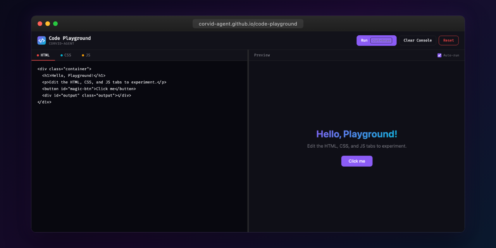

<p align="center"></p>

# Code Playground

An in-browser HTML/CSS/JS code playground with live preview, built as a single self-contained HTML file.

Part of the **corvid-agent** tool suite.

## Features

- **Tabbed editor** for HTML, CSS, and JavaScript with monospace font (Fira Code)
- **Live preview** iframe that auto-updates as you type (with debounce)
- **Console output** panel capturing `console.log`, `console.error`, `console.warn`, and `console.info`
- **Run, Clear Console, Reset** controls
- **Keyboard shortcuts**: `Ctrl+Enter` to run, `Ctrl+1/2/3` to switch tabs
- **Resizable panels** -- drag the dividers between editor/preview and preview/console
- **Auto-run toggle** to enable or disable live updates
- **Responsive layout** -- side-by-side on desktop, stacked on mobile
- **Dark theme** matching the corvid-agent design system
- **Zero dependencies** -- pure vanilla HTML, CSS, and JavaScript

## Usage

Open `index.html` in any modern browser, or visit the GitHub Pages deployment:

```
https://corvid-agent.github.io/code-playground/
```

## Design System

| Token          | Value     |
| -------------- | --------- |
| Background     | `#08080f` |
| Card           | `#12121a` |
| Accent Purple  | `#8b5cf6` |
| Accent Cyan    | `#06b6d4` |
| Text           | `#e4e4e7` |
| Text Dim       | `#71717a` |
| Border         | `#27272a` |

## License

MIT
